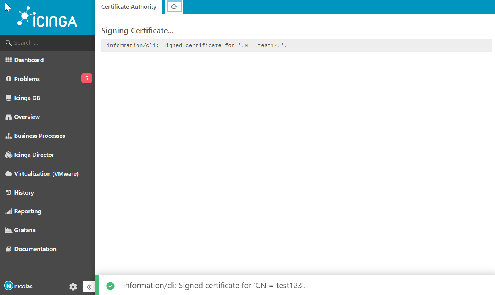
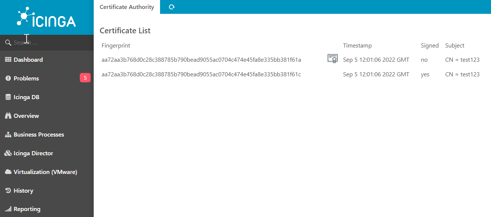
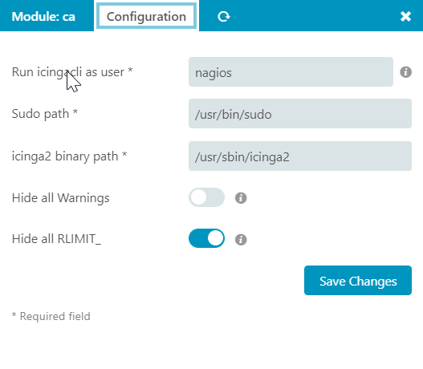

# CA Module for Icinga Web 2


1. [About](#about)
2. [Requirements](#requirements)
3. [License](#license)
4. [Getting Started](#getting-started)
5. [Contributing](#contributing)

## About

The Certificate Authority Module for Icinga Web 2 allows the user to manage the
local Icinga Certification Authority.

## Requirements

* Icinga Web 2 version 2.10+
* PHP version 5.6.x or 7.x

## License

The CA Module for Icinga Web 2 is licensed under the terms of the GNU
General Public License Version 2, you will find a copy of this license in the
[COPYING](COPYING) file included in the source package.

## Getting Started

Nothing special. As with every Icinga Web 2 module, drop this to one of your
`modules` folders and make sure that the folder name is `ca`. Because the web
server doesn't run as `icinga` user, we need to allow for the sudo operations:

### Installation

1. Download the [latest version](https://github.com/moreamazingnick/icingaweb2-module-ca/archive/refs/heads/master.zip) as tarball
2. Extract the tarball in the Icinga Web 2 `modules` directory
3. Make sure the CA module folder is named `ca`

**For Developers only**

Clone the repository via Git to your Icinga Web 2 `modules` directory.

### Configuration
Add this to sudoers file of your choice
nagios should be the user you set in the modules settings
www-data should be the user whos running your webserver
```
www-data ALL = (nagios) NOPASSWD: /usr/sbin/icinga2 ca sign *
www-data ALL = (nagios) NOPASSWD: /usr/sbin/icinga2 ca list --all --json
www-data ALL = (nagios) NOPASSWD: /usr/sbin/icinga2 --version

```

## Screenshots

Sign Screenshot:



Module Information Screenshot:



Module Config Screenshot:




## Contributing

There are many ways to contribute to Icinga -- whether it be sending patches,
testing, reporting bugs, or reviewing and updating the documentation. Every
contribution is appreciated!
